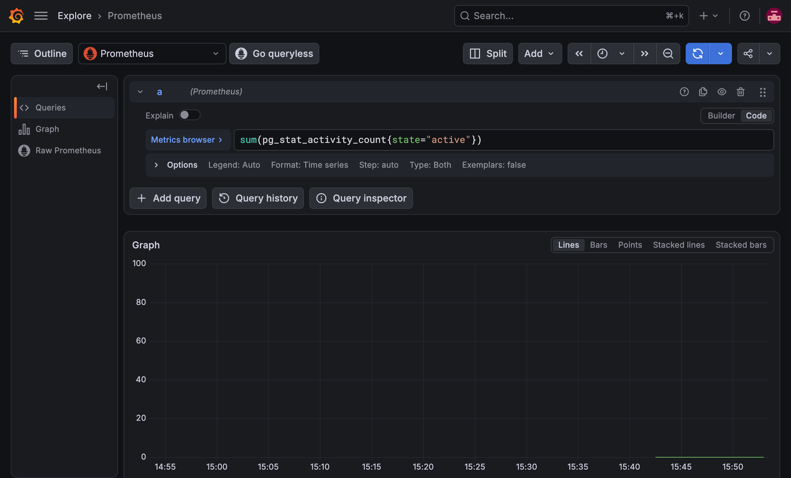
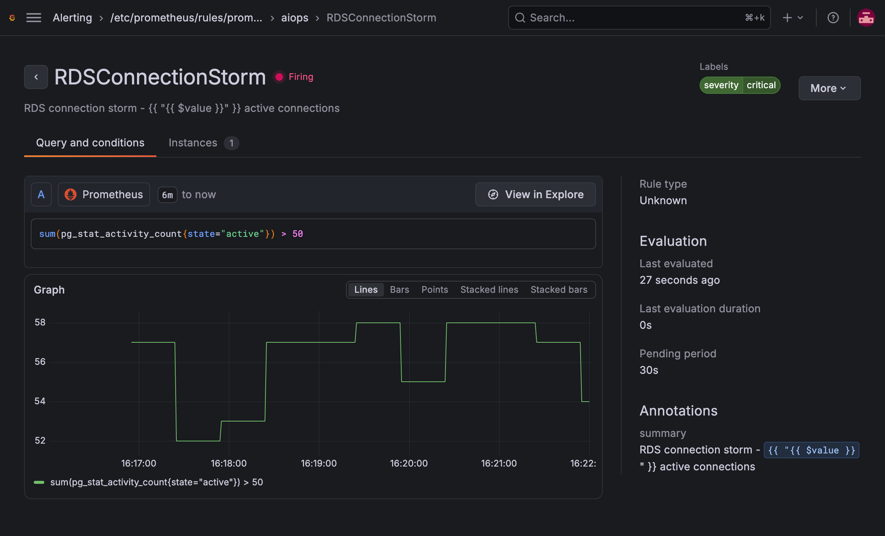
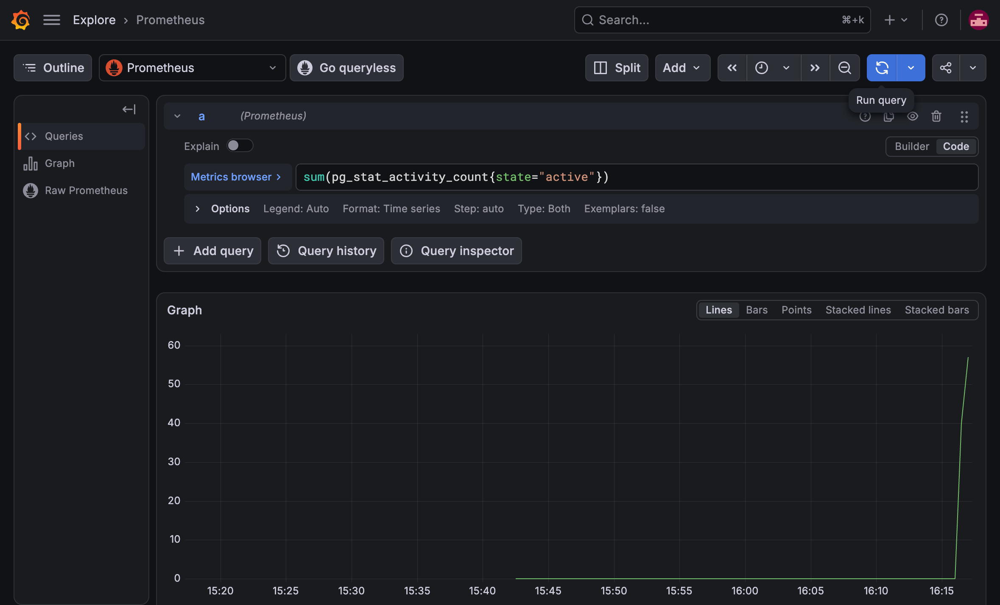
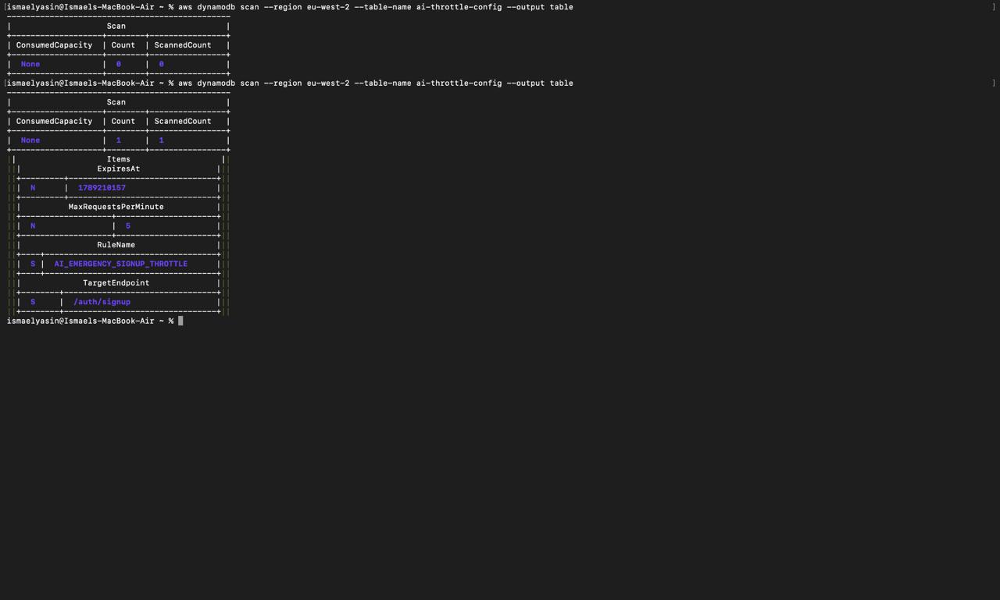
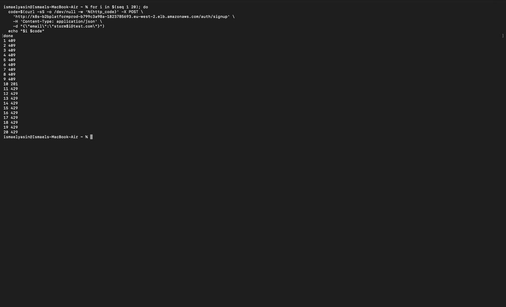
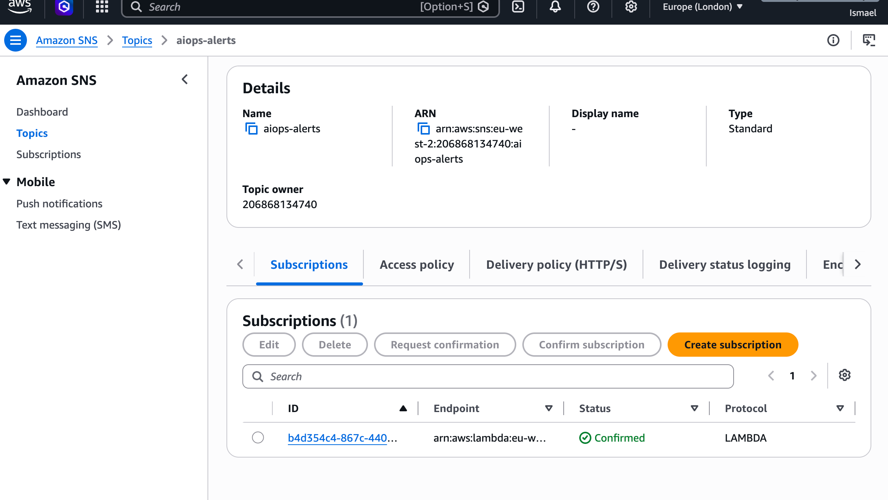
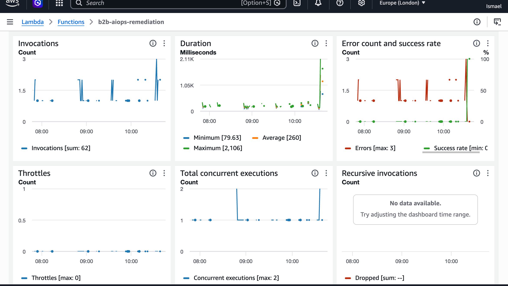
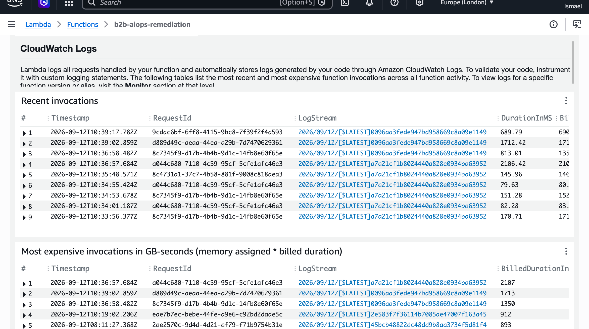

<p align="center">
  
</p>

<h1 align="center">B2B EKS Platform — Microservices on Amazon EKS</h1>

<p align="center">
  <strong>Five FastAPI services on one EKS cluster</strong> — Terraform (persistent + cluster), Argo CD GitOps,
  GitHub Actions OIDC into ECR, ALB + WAF at the edge, CloudFront storefront, and an AIOps loop
  (Locust → Prometheus → SNS → Lambda / Bedrock → DynamoDB → auth 429).<br/>
  <em>Live in <code>eu-west-2</code>. Destroy the cluster stack when the demo window ends; persistent (ECR, OIDC, AIOps, storefront bucket) stays.</em>
</p>

<p align="center">
  
  <a href="https://github.com/ismaelyasindev/b2b-eks-platform/actions"></a>
  <a href="https://d2dx5pzn9z18zo.cloudfront.net"></a>
</p>

<p align="center">
  
  
  
  
  
  
  
  
  
  
  
  
</p>

---

## Why this project

Most “hello world on EKS” repos stop at a Deployment and a LoadBalancer. This one is built like a **real multi-service platform**:

- Infrastructure is **Terraform in two layers** — `persistent/` survives teardown; `cluster/` is EKS, VPC, RDS, Karpenter
- Images ship with **GitHub OIDC → ECR** (no long-lived AWS keys); Argo CD syncs Helm to `dev` / `prod`
- Edge is **ALB (path prefixes) + regional WAF**; storefront is **S3 + CloudFront** (OAC, `/api` strip)
- Observability is **kube-prometheus-stack + postgres-exporter**
- AIOps is a **closed loop**: connection storm → alert → SNS → Lambda / Haiku → DynamoDB TTL → **HTTP 429** on `/auth/signup`

> Modelled on the “Online Boutique” shape (one cluster, many services) — Python/FastAPI, one Postgres per env with schema isolation, GitOps, and a chaos demo you can screenshot.

---

## Demo

Storefront on **CloudFront** (S3 origin + `/api/*` to the prod ALB). Same shop a recruiter opens in the browser.

<p align="center">
  <a href="https://d2dx5pzn9z18zo.cloudfront.net"></a>
</p>


<p align="center">
  <em>If the player does not start, open <a href="docs/assets/09-storefront-demo.mp4">docs/assets/09-storefront-demo.mp4</a> on GitHub (browser-native MP4). The original QuickTime file is <a href="docs/assets/09-storefront-demo.mov">09-storefront-demo.mov</a>.</em>
</p>

---

## What runs where

| Layer | What it owns |
|-------|----------------|
| **Persistent** | ECR, Secrets Manager envelopes, GitHub OIDC roles, AIOps (SNS, Lambda, DynamoDB, runbooks bucket), storefront S3 |
| **Cluster** | VPC, NAT, EKS, node group + Karpenter, RDS `dev`/`prod`, SQS, WAF, ALB controller, Argo CD, CloudFront |
| **GitOps** | App-of-Apps + ApplicationSet for five services × two namespaces |
| **Edge** | Prod ALB group `b2b-platform-prod`; CloudFront default domain; WAF on the ALB (not on CloudFront) |

---

## Infrastructure highlights

<table>
<tr>
<td width="50%">

### Cluster & GitOps
- EKS **1.33** in **eu-west-2**, Karpenter for burst (Locust)
- **Argo CD** Helm from git; image tags in `values-dev.yaml` / `values-prod.yaml`
- **Pod Identity** for DB secrets, SQS, Alertmanager SNS, ALB controller

</td>
<td width="50%">

### Edge
- Ingress **ALB**, `target-type: ip`, path prefixes `/auth` `/product` …
- **WAF** WebACL on the ALB (rate-limit / managed rules)
- **CloudFront**: private S3 (OAC) + ALB origin; Function strips `/api`

</td>
</tr>
<tr>
<td width="50%">

### Data
- RDS **Postgres 16**, one instance per env
- Per-service DB users (`auth_user`, …) + `exporter_user`
- Secrets Manager → Kubernetes secrets (not in git)

</td>
<td width="50%">

### Observability & AIOps
- Grafana / Prometheus; `pg_stat_activity_count`
- Alert `RDSConnectionStorm` → SNS `aiops-alerts`
- Lambda + **Bedrock Haiku 4.5** (EU inference profile) → DynamoDB throttle flag

</td>
</tr>
</table>

---

## AIOps loop (proven)

In-cluster Locust hits `auth-svc.prod` with `X-Trigger-Storm` so signup holds DB connections. Prometheus fires when `sum(pg_stat_activity_count{state="active"}) > 50` for 30s. Alertmanager publishes to SNS; Lambda reads the S3 runbook, calls Bedrock, writes `AI_EMERGENCY_SIGNUP_THROTTLE` (TTL). Auth pods poll DynamoDB and return **429** before Postgres.

WAF stays **Normal** on purpose — Locust never goes through the ALB.

<p align="center"><strong>1 — Grafana baseline</strong></p>
<p align="center">
  
</p>

<p align="center"><strong>2 — RDS connection storm</strong></p>
<p align="center">
  
</p>

<p align="center"><strong>3 — Locust spike</strong></p>
<p align="center">
  
</p>

<p align="center"><strong>4 — DynamoDB emergency throttle</strong></p>
<p align="center">
  
</p>

<p align="center"><strong>5 — Auth signup 429</strong></p>
<p align="center">
  
</p>

<p align="center"><strong>6 — SNS topic aiops-alerts</strong></p>
<p align="center">
  
</p>

<p align="center"><strong>7 — Lambda monitoring</strong></p>
<p align="center">
  
</p>

<p align="center"><strong>8 — Lambda logs (Bedrock + PutItem)</strong></p>
<p align="center">
  
</p>

---

## CI/CD — OIDC, no long-lived AWS keys

Secrets store **role ARNs** — never AWS access keys.

| Workflow | Trigger | Purpose |
|----------|---------|---------|
| `01 - Test, Build & Push` | `app/**` or manual | Ruff, pytest, Docker, **Trivy** HIGH/CRITICAL, push `dev-<sha>` to ECR, PR to bump `values-dev.yaml` |
| `01b - Promote to Production` | Manual (`sha`) | Retag `dev-<sha>` → `prod-<sha>`, PR for `values-prod.yaml` |
| `02 - Infrastructure Lint & Plan` | `terraform/**` or manual | `fmt`, validate, TFLint, **Checkov** (soft-fail on persistent), `terraform plan` |
| `03 - Infrastructure Apply` | Manual | Apply `persistent` or `cluster` |
| `05 - Deploy Storefront` | `eks-frontend/**` or manual | `s3 sync` + CloudFront invalidation |
| `04 - Terraform Destroy` | Manual | Tear down **cluster** (keep persistent) |

<p align="center">
  <a href="https://github.com/ismaelyasindev/b2b-eks-platform/actions/workflows/build-and-push.yml"></a>
  <a href="https://github.com/ismaelyasindev/b2b-eks-platform/actions/workflows/terraform-plan.yml"></a>
  <a href="https://github.com/ismaelyasindev/b2b-eks-platform/actions/workflows/deploy-frontend.yml"></a>
</p>

---

## Repository layout

```text
├── .github/workflows/     # OIDC: build, promote, plan, apply, destroy, storefront
├── app/                   # Five FastAPI services + Compose + Dockerfile
├── eks-frontend/          # Static storefront (S3 + CloudFront)
├── gateway/               # Local nginx /api strip (Compose --profile ui)
├── kubernetes/            # Helm chart + Argo CD apps
├── terraform/
│   ├── bootstrap/         # State bucket + lock (once)
│   ├── persistent/        # ECR, OIDC, AIOps, storefront bucket
│   ├── cluster/           # VPC, EKS, RDS, WAF, CloudFront
│   └── modules/
├── load-tests/            # Locust Job (manual Argo sync)
├── aiops/                 # Runbook + remediation Lambda
├── scripts/               # RDS role seed (optional)
└── docs/assets/           # README evidence stills
```

---

## Deploy model

### First-time (local Terraform, then GitOps)

```bash
cd terraform/persistent
terraform init && terraform apply

cd ../cluster
terraform init && terraform apply
```

Set `api_origin_domain` in `terraform/cluster/terraform.tfvars` (gitignored) to the **prod ALB hostname** after Ingress is ready, then apply again to create CloudFront.

Images: merge the automated **dev** PR from workflow 01; promote with **01b** using the SHA that **01** actually built.

### Storefront

```bash
aws s3 sync eks-frontend/ s3://b2b-platform-storefront-london/ --delete --region eu-west-2
# or GitHub Actions 05 — Deploy Storefront Frontend
```

### Safety rails

- **Persistent vs cluster** state files — destroy cluster without wiping ECR/OIDC
- Trivy **exit-code 1** on HIGH/CRITICAL (OS patches via `apt-get upgrade` in the Dockerfile)
- Locust Application has **no automated sync**
- `terraform.tfvars` is gitignored

---

## Security model (short version)

| Control | Implementation |
|---------|----------------|
| No public storefront bucket | CloudFront **OAC** only |
| No long-lived AWS keys in CI | **GitHub OIDC** assume-role |
| App secrets | Secrets Manager + Pod Identity `GetSecretValue` |
| Edge abuse | **WAF** on the ALB (Locust bypasses it by design) |
| Storm stop | App-level 429 + DynamoDB **TTL** — no GitOps drift on WAF |
| Image scan | Trivy in Actions before ECR push |

---

## Teardown

When the live window ends, destroy **cluster** only (NAT, EKS, RDS, CloudFront). Keep **persistent**.

| Destroy (cluster) | Retain (persistent) |
|-------------------|---------------------|
| VPC, NAT, EKS, RDS, ALBs, WAF, CloudFront | ECR images, OIDC roles, Secrets Manager |
| Node groups / Karpenter nodes | SNS, Lambda, DynamoDB throttle table, runbooks S3 |
| | Storefront bucket, tfstate bucket |

Park overnight without destroy: stop both RDS instances; delete the Locust Job.

---

## Run locally (no AWS required)

```bash
cd app
cp .env.example .env   # if present
docker compose up --build
```

Optional UI (nginx `/api` strip, same contract as CloudFront):

```bash
docker compose --profile ui up --build
# http://localhost:8080
```

---

## Live verification (while deployed)

```bash
curl -sS -o /dev/null -w '%{http_code}\n' \
  https://d2dx5pzn9z18zo.cloudfront.net/

curl -sS -o /dev/null -w '%{http_code}\n' -X POST \
  http://k8s-b2bplatformprod-b799c3a98a-1823785693.eu-west-2.elb.amazonaws.com/auth/signup \
  -H 'Content-Type: application/json' \
  -d '{"email":"probe@example.com"}'
```

| Check | Expected (when live) |
|-------|----------------------|
| CloudFront `/` | Storefront HTML |
| Catalog | `/api/product/list` via CloudFront → ALB `/product/list` |
| AIOps (after storm + Lambda) | `/auth/signup` **429** while the DynamoDB TTL is valid |
| GitHub Actions | 01 / 02 / 05 green |

---

## Author

**Ismael Yasin** — DevOps & Cloud Engineer  
Portfolio: [ismaelyasin.site](https://www.ismaelyasin.site) · GitHub: [ismaelyasindev](https://github.com/ismaelyasindev)

---

<p align="center">
  <em>Built for production habits — Terraform, OIDC, GitOps, and an AIOps loop you can screenshot.</em>
</p>
